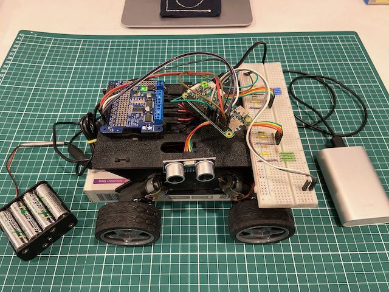

# Rover Kit

Adventures in building a toy rover that can respond to commands over Wi-Fi and send back readings from ultrasonic distance sensors.

## Parts

The rover is based on the following parts:

* [Whippersnapper Runt Rover](https://www.servocity.com/whippersnapper-runt-rover)
* [Raspberry Pi Zero W](https://www.raspberrypi.com/products/raspberry-pi-zero-w)
* [Adafruit DC & Stepper Motor HAT](https://www.adafruit.com/product/2348)
* [HC-SR04 Ultrasonic Distance Sensor](https://www.sparkfun.com/products/15569) (x5)

This is all wired up with an assortment of resistors, jumper wires, and breadboards.

Power to the Motor HAT is provided by a 12V battery pack. And power to the Raspberry Pi is provided by a portable USB power supply.

### Early Prototype

## Python

The on-device scripts for controlling the rover are written in Python, and rely on some very useful libraries:

* [Adafruit_CircuitPython_MotorKit](https://github.com/adafruit/Adafruit_CircuitPython_MotorKit)
* [RPi.GPIO](https://pypi.org/project/RPi.GPIO)

Test scripts:

* [test-motors.py](./src/test-motors.py) - starts and stops each motor in turn
* [test-sensors.py](./src/test-sensors.py) - outputs a series of ultrasonic sensor readings

Main control script:

* [rover-control.py](./src/rover-control.py) - runs a web server that can be used to control the rover

## Rover Control

The _Rover Control_ frontend, which is served by the [rover-control.py](./src/rover-control.py) script, is pretty ordinary HTML and JavaScript.

The code can be found in [src/web](./src/web).

## License

This code is licensed under the MIT License.

See the LICENSE file for more information.
