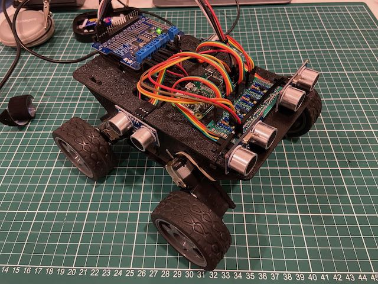

# Rover Kit

Adventures in building a toy rover that can respond to commands over Wi-Fi and send back readings from ultrasonic distance sensors.



## Overview

This project is inspired by [Mat Kelcey's Drivebot post](https://matpalm.com/blog/drivebot/), but focuses more hardware hacking and a Go + MQTT software stack.

Key characteristics:

- Control and telemetry are split into three Go commands.
- Components communicate over MQTT topics.
- The codebase includes local GPIO implementations for motor control and sonar measurements.

Hardware:

- [Whippersnapper Runt Rover](https://www.servocity.com/whippersnapper-runt-rover)
- [Raspberry Pi Zero W](https://www.raspberrypi.com/products/raspberry-pi-zero-w)
- [Adafruit DC & Stepper Motor HAT](https://www.adafruit.com/product/2348)
- [HC-SR04 Ultrasonic Distance Sensor](https://www.sparkfun.com/products/15569) (x4)

Power:

- Motor HAT: 12V battery pack
- Raspberry Pi: portable USB power supply

## Project Layout

### Commands

- `cmd/motor-control` - Subscribes to typed motor commands and invokes a `MotorDriver`.
- `cmd/sonar-reader` - Samples via `SonarProvider` and publishes distance events.
- `cmd/web-bridge` - HTTP/WebSocket bridge into broker topics.

### Shared packages

- `pkg/common` - Message types and broker abstractions
- `pkg/motor` - `MotorDriver` interface + GPIO implementation
- `pkg/sonar` - `SonarProvider` interface + GPIO implementation

## Running Locally

### MQTT broker (PC)

Install and run [Mosquitto](https://mosquitto.org/) via Docker Compose:

```bash
docker compose up -d mqtt
docker compose down
```

### Demo stack

```bash
./scripts/compose.sh
```

This starts MQTT plus all three commands with dummy drivers/providers for quick demos.

## Raspberry Pi Setup

### Install Mosquitto

```bash
sudo apt update
sudo apt install -y mosquitto mosquitto-clients
sudo systemctl enable mosquitto
sudo systemctl start mosquitto
```

Verify:

```bash
sudo systemctl status mosquitto
mosquitto_sub -h localhost -t '$SYS/#' -C 1
```

If needed, Go commands allow you to set the broker URL explicitly:

- `MQTT_BROKER=tcp://<pi-hostname-or-ip>:1883`

### Enable I2C

Required for motor control:

```bash
sudo raspi-config nonint do_i2c 0
sudo apt install -y python3-pip python3-venv i2c-tools
```

### Build binaries

Build directly on the Pi:

```bash
go build -ldflags "-w" -o bin/motor-control ./cmd/motor-control
go build -ldflags "-w" -o bin/sonar-reader ./cmd/sonar-reader
go build -ldflags "-w" -o bin/web-bridge ./cmd/web-bridge
```

Or cross-compile from another machine:

```bash
make
```

The commands can be run manually, or orchestrated using `systemd`.

## Systemd

Service templates are provided under `deploy/systemd`:

- `rover-motor-control.service`
- `rover-sonar-reader.service`
- `rover-web-bridge.service`
- `rover-stack.target` (optional convenience target)

### Installation

This example assumes the repo is deployed at `/opt/rover-kit` and binaries are in `/opt/rover-kit/bin`.

```bash
sudo mkdir -p /opt/rover-kit/bin
sudo cp bin/motor-control bin/sonar-reader bin/web-bridge /opt/rover-kit/bin/
sudo cp deploy/systemd/*.service deploy/systemd/*.target /etc/systemd/system/
```

### Enable Services

```bash
sudo systemctl daemon-reload
sudo systemctl enable --now mosquitto
sudo systemctl enable --now rover-motor-control rover-sonar-reader rover-web-bridge
```

Optional single-target startup:

```bash
sudo systemctl enable --now rover-stack.target
```

### Monitoring

```bash
sudo systemctl status rover-motor-control rover-sonar-reader rover-web-bridge
sudo journalctl -u rover-motor-control -u rover-sonar-reader -u rover-web-bridge -f
```

## Running Commands Manually

### Motor control

```bash
go run ./cmd/motor-control
```

Environment variables:

- `MQTT_BROKER` (default `tcp://localhost:1883`)
- `MQTT_TOPIC` (default `rover/motor/cmd`)
- `MQTT_CLIENT_ID` (default auto-generated)
- `MOTOR_COMMAND_COOLDOWN_MS` (default `0`)
- `MOTOR_DRIVER` (`dummy`, `gobot`, or `periph` - default to `dummy`)

Test by injecting commands using `mosquitto_pub`:

```bash
mosquitto_pub -h localhost -p 1883 -t rover/motor/cmd -m '{"type":"forwards"}'
mosquitto_pub -h localhost -p 1883 -t rover/motor/cmd -m '{"type":"spin_ccw"}'
mosquitto_pub -h localhost -p 1883 -t rover/motor/cmd -m '{"type":"throttle","value":0.75}'
mosquitto_pub -h localhost -p 1883 -t rover/motor/cmd -m '{"type":"stop"}'
```

### Sonar Reader

```bash
go run ./cmd/sonar-reader
```

Environment variables:

- `MQTT_BROKER` (default `tcp://localhost:1883`)
- `MQTT_TOPIC` (default `rover/sonar/sample`)
- `MQTT_CLIENT_ID` (default auto-generated)
- `SONAR_PROVIDER` (`dummy`, `periph` or `uart` - default to `dummy`)

```bash
mosquitto_pub -h localhost -p 1883 -t rover/sonar/sample
```

Note: The `uart` sonar provider is still in development.

### Web Bridge

```bash
go run ./cmd/web-bridge
```

Starts a local web server on port 7200.

## Firmware

Provides firmware for STM32 microcontrollers to collect ultrasonic distance readings via UART.

Targets the [STM32F3DISCOVERY](https://www.st.com/en/evaluation-tools/stm32f3discovery.html) board, using a [custom fork](https://github.com/tristanpenman/tinygo) of TinyGo. I hope to merge these changes upstream once stabilised.

### TinyGo Sonar

Scaffold at `firmware/sonar` streams framed sonar samples over UART.

```bash
make tinygo-sonar
```

Installation:

```bash
./scripts/update-firmware.sh sonar
```

### TinyGo hello UART sample

The `firmware/hello` example writes a UART heartbeat and echoes host bytes. This can be useful for debugging.

```bash
make tinygo-hello
```

Installation:

```bash
./scripts/update-firmware.sh hello
```

## Tests

From repo root:

```bash
make test
```

Coverage currently emphasizes:

- command parsing in `cmd/web-bridge`
- env fallback logic in `pkg/common`

## Photos

Prototype build photos are in [`./photos`](./photos), including:

- early prototype on Pi 3
- migration to Pi Zero W
- sonar board soldering progress

## License

This code is licensed under the MIT License.

See the [LICENSE](./LICENSE) file for more information.
