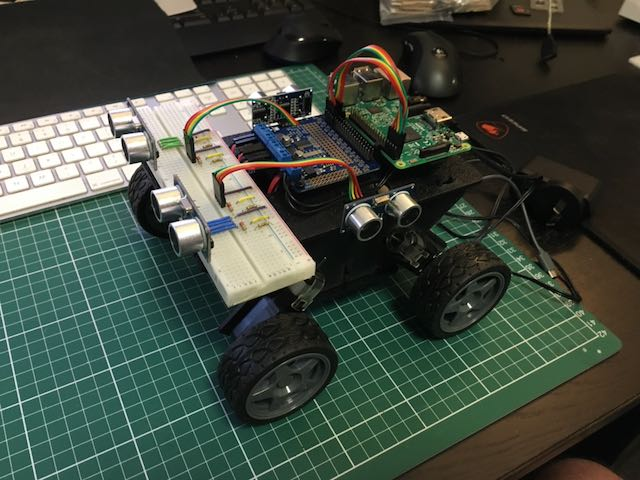
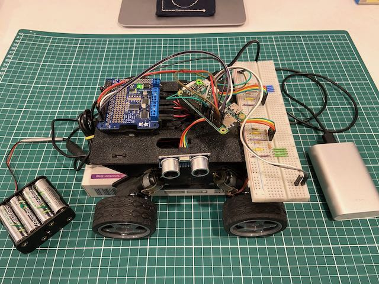
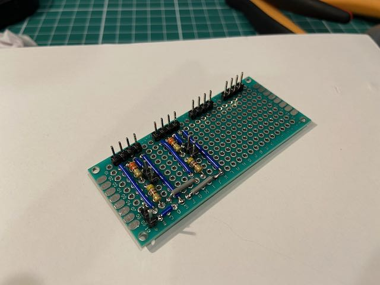
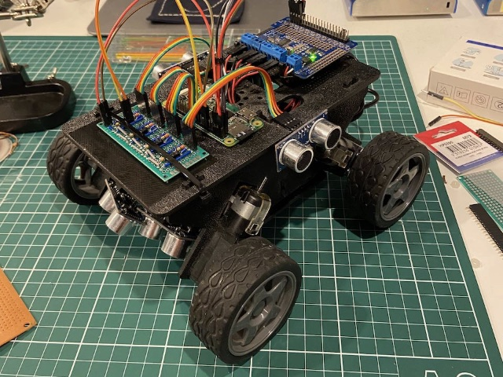

# Rover Kit

Adventures in building a toy rover that can respond to commands over Wi-Fi and send back readings from ultrasonic distance sensors.


## Inspiration

This project is inspired by a [blog post by Mat Kelcey](https://matpalm.com/blog/drivebot/) about building a rover and training it to move around autonomously.

I've used the same basic parts, but taken the project in a different direction. My focus is primarily hardware hacking.

## Parts

The rover is based on the following parts:

* [Whippersnapper Runt Rover](https://www.servocity.com/whippersnapper-runt-rover)
* [Raspberry Pi Zero W](https://www.raspberrypi.com/products/raspberry-pi-zero-w)
* [Adafruit DC & Stepper Motor HAT](https://www.adafruit.com/product/2348)
* [HC-SR04 Ultrasonic Distance Sensor](https://www.sparkfun.com/products/15569) (x4)

This is all wired up with an assortment of resistors, jumper wires, and breadboards.

Power to the Motor HAT is provided by a 12V battery pack. Power to the Raspberry Pi is provided by a portable USB power supply.

### Prototype

When I first started this project, I was using a regular Raspberry Pi 3 with components connected via a breadboard:



I eventually switched to using a Raspberry Pi Zero W, so that power usage and space requirements would be reduced:



Next, I eliminated the ugly breadboard by soldering my own sonar sensor interface. This was very slow because I'm new to soldering:



Everything looked much neater with the new interface board. The next step was to figure out wiring:



Other photos can be found [here](./photos).

## Source

My original Python implementation can be found in the [python](./python/) directory.

The project has since been migrated to Go, with MQTT for message passsing. The rest of this file explains how to get up and running.

## Layout

This consists of three commands:

- `cmd/motor-control` - Subscribes to typed motor commands and invokes a `MotorDriver` implementation
- `cmd/sonar-reader` - Consumes a `SonarProvider` implementation and publishes distance events
- `cmd/web-bridge` - HTTP/WebSocket bridge from browser clients into broker topics

Shared packages include:

- `pkg/common` - Message types, strongly-typed command/event models, and broker abstractions
- `pkg/motor` - Defines a `MotorDriver` interface and local implementation using GPIO
- `pkg/sonar` - Defines a `SonarProvider` interface and local implementation using GPIO

## MQTT

Communication between components is handled by MQTT.

This section describes how to start a message broker and connect to it via the three commands listed above.

### Local MQTT broker

The easiest way to get started is to use the [Mosquitto](https://mosquitto.org/) message broker. Mosquitto is a popular and light-weight message broker that implements the MQTT protocol.

To start the local MQTT broker you'll need to use [Docker Compose](https://docs.docker.com/compose/):

```bash
docker compose up -d mqtt
```

To stop the broker:

```bash
docker compose down
```

## Components

Thanks to MQTT, components can be developed and tested independently. Each component is encapsulated as a Go command. Commands subscribe only to the messages that are relevant to them, and may publish messages that are handled by other components.

### Motor Control

As an example, the `motor-control` command subscribes to `rover/motor/command` messages. Running the command will connect to MQTT using default configuration:

```bash
go run ./cmd/motor-control
```

MQTT configuration can be customised via environment variables:

- `MQTT_BROKER` (default `tcp://localhost:1883`)
- `MQTT_TOPIC` (default `rover/motor/command`)
- `MQTT_CLIENT_ID` (default is auto-generated)

### Injecting Commands

If you have `mosquitto_pub` installed locally:

```bash
mosquitto_pub -h localhost -p 1883 -t rover/motor/command -m '{"type":"forwards"}'
mosquitto_pub -h localhost -p 1883 -t rover/motor/command -m '{"type":"spin_ccw"}'
mosquitto_pub -h localhost -p 1883 -t rover/motor/command -m '{"type":"throttle","value":0.75}'
mosquitto_pub -h localhost -p 1883 -t rover/motor/command -m '{"type":"stop"}'
```

To use `mosquitto_pub` on macOS, install `mosquitto` from Homebrew:

```bash
brew install mosquitto
```

Alternatively, you can run `mosquitto_pub` commands from within the `mqtt` Docker container created above:

```bash
docker compose exec mqtt mosquitto_pub -t rover/motor/command -m '{"type":"throttle","value":0.75}'
```

## License

This code is licensed under the MIT License.

See the [LICENSE](./LICENSE) file for more information.
