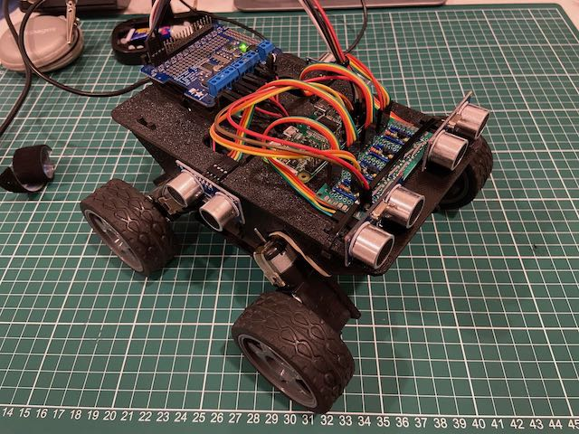
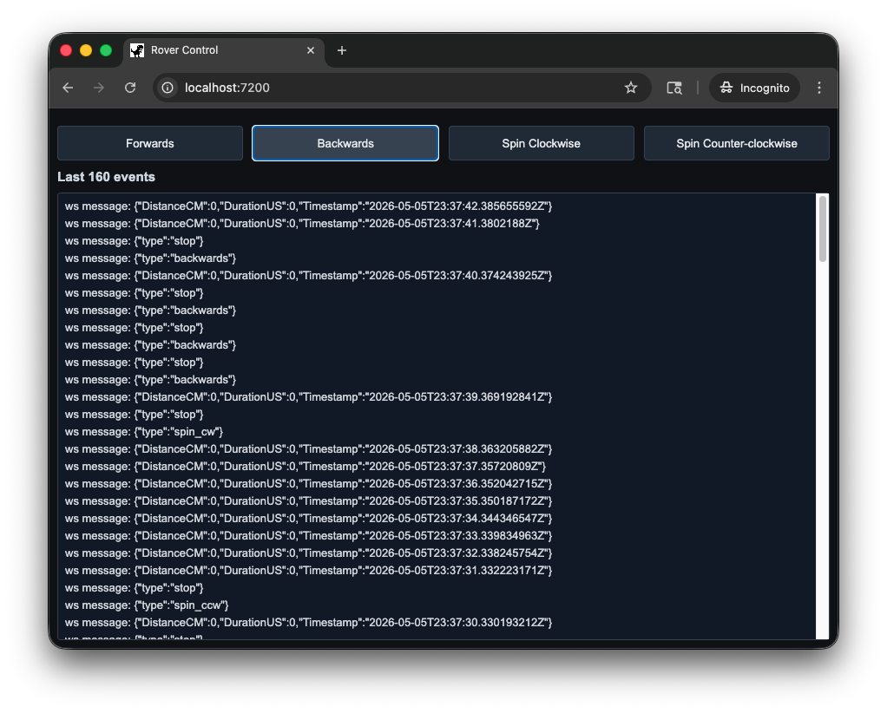

# Rover Kit

Adventures in building a toy rover that can respond to commands over Wi-Fi and send back readings from ultrasonic distance sensors.



## Overview

This project is inspired by [Mat Kelcey's Drivebot post](https://matpalm.com/blog/drivebot/), but focuses on hardware hacking with a Go + MQTT software stack. It is intended to serve as an end-to-end Raspberry Pi robotics example. Motors are driven using MQTT commands, sonar readings are published back as telemetry, and a browser UI talks to the rover through a WebSocket bridge.

Key characteristics:

- Control and telemetry are split into separate Go commands so each can be explored independently.
- Components communicate over MQTT topics, which keeps the web UI, motor control, and sensor sampling loosely coupled.
- The codebase includes dummy implementations for local development, and GPIO/I2C/UART implementations for Raspberry Pi hardware.
- `systemd` units are included so the complete rover stack can start automatically when the Pi boots.

Hardware:

- [Whippersnapper Runt Rover](https://www.servocity.com/whippersnapper-runt-rover)
- [Raspberry Pi Zero W](https://www.raspberrypi.com/products/raspberry-pi-zero-w)
- [Adafruit DC & Stepper Motor HAT](https://www.adafruit.com/product/2348)
- [HC-SR04 Ultrasonic Distance Sensor](https://www.sparkfun.com/products/15569) (x4)

Power:

- Motor HAT: 12V battery pack
- Raspberry Pi: portable USB power supply

## Project Layout

### Commands

- `cmd/motor-control` - Subscribes to typed motor commands and invokes a `MotorDriver`.
- `cmd/sonar-reader` - Samples via `SonarProvider` and publishes distance events.
- `cmd/camera-reader` - Captures Raspberry Pi camera frames and publishes image events.
- `cmd/web-bridge` - HTTP/WebSocket bridge into broker topics.

### Shared packages

- `pkg/common` - Message types and broker abstractions
- `pkg/motor` - `MotorDriver` interface + GPIO implementation
- `pkg/sonar` - `SonarProvider` interface + GPIO implementation
- `pkg/camera` - camera `Provider` interface + dummy and Raspberry Pi camera implementations
- `pkg/uart` - Framing protocol shared between the STM32 firmware and the `uart` sonar provider

## Go Libraries Used

The repository uses a few different Go hardware libraries so you can compare the trade-offs when planning your own Raspberry Pi project.

### Gobot

[Gobot](https://gobot.io/) is a robotics and physical-computing framework for Go. In this repo, we use Gobot's Raspberry Pi adapter and I2C bus and Adafruit Motor HAT drivers to control the 4 DC motors. Gobot is a great option when you want higher-level robotics building blocks, drivers for common devices, and a consistent API across different boards and transports.

Activate the `gobot` motor driver using the `MOTOR_DRIVER` environment variable:

```bash
MOTOR_DRIVER=gobot go run ./cmd/motor-control
```

### Periph

[Periph](https://periph.io/) is a lower-level Go hardware stack for Linux SBCs (single-board computers). In this repo, we use Periph to connect to the PCA9685 chip on the Motor HAT, and to perform direct GPIO pulse timing with HC-SR04 sensors. It is useful when you want idiomatic Go access to Linux GPIO, I2C, SPI, and PWM without bringing in a larger robotics framework.

The `periph` motor driver and sonar provider can be activated using the `MOTOR_DRIVER` and `SONAR_PROVIDER` environment variables:

```bash
MOTOR_DRIVER=periph go run ./cmd/motor-control
SONAR_PROVIDER=periph go run ./cmd/sonar-reader
```

### Serial

[`go.bug.st/serial`](https://pkg.go.dev/go.bug.st/serial) provides cross-platform serial-port access from Go. The `uart` sonar provider uses it to read framed measurements from a microcontroller attached over USB serial, which is usually exposed on Linux as a device such as `/dev/ttyUSB0` or `/dev/ttyACM0`. This is a practical extension point when a Raspberry Pi is not the best place to perform tight timing, analogue sampling, or real-time control.

The UART sonar provider also requires the path to a UART port:

```bash
SONAR_PROVIDER=uart SONAR_UART_PORT=/dev/ttyUSB0 go run ./cmd/sonar-reader
```

Note that the UART provider still a work in progress.

## Running Locally

To develop individual components, you can run an MQTT broker using Docker.

Alternatively, you can run a full "demo" stack that uses dummy `Provider` and `Driver` implementations.

### MQTT broker (PC)

Install and run [Mosquitto](https://mosquitto.org/) via Docker Compose:

```bash
docker compose up -d mqtt
docker compose down
```

### Demo stack

The full demo stack can be started using Docker Compose. Simply run the `compose.sh` helper script:

```bash
./scripts/compose.sh
```

This starts MQTT plus all three commands using dummy drivers/providers. The web bridge will be started on port 7200:



## Raspberry Pi Setup

### Install Mosquitto

```bash
sudo apt update
sudo apt install -y mosquitto mosquitto-clients
sudo systemctl enable mosquitto
sudo systemctl start mosquitto
```

Verify:

```bash
sudo systemctl status mosquitto
mosquitto_sub -h localhost -t '$SYS/#' -C 1
```

For development, Go commands allow you to set the broker URL explicitly:

- `MQTT_BROKER=tcp://<pi-hostname-or-ip>:1883`

Otherwise the defaults should be sufficient.

### Enable I2C

Required for motor control:

```bash
sudo raspi-config nonint do_i2c 0
sudo apt install -y python3-pip python3-venv i2c-tools
```

### Build binaries

These can be built directly on the Pi:

```bash
go build -ldflags "-w" -o bin/motor-control ./cmd/motor-control
go build -ldflags "-w" -o bin/sonar-reader ./cmd/sonar-reader
go build -ldflags "-w" -o bin/camera-reader ./cmd/camera-reader
go build -ldflags "-w" -o bin/web-bridge ./cmd/web-bridge
```

Or cross-compiled from another machine using the provided `Makefile`:

```bash
make
```

Once compiled, the commands can be run manually, or orchestrated using `systemd`.

## Systemd

Running a rover from an SSH session is fine while experimenting, but inconvenient for real world use. `systemd` lets the Pi bring every long-running component online at startup. Mosquitto starts first, then motor control, sonar sampling, and the web bridge can run as managed services without you typing three separate commands.

Systemd service templates are provided under `deploy/systemd`:

- `rover-motor-control.service`
- `rover-sonar-reader.service`
- `rover-camera-reader.service`
- `rover-web-bridge.service`

You may need to update the user configured in these files before deploying to your device.

This includes an optional convenience target:

- `rover-stack.target`

### Installation

This example assumes the repo is deployed at `/opt/rover-kit` and binaries are in `/opt/rover-kit/bin`.

From your working directory:

```bash
sudo mkdir -p /opt/rover-kit/bin
sudo cp bin/motor-control bin/sonar-reader bin/camera-reader bin/web-bridge /opt/rover-kit/bin/
sudo cp deploy/systemd/*.service deploy/systemd/*.target /etc/systemd/system/
```

### Enable Services

```bash
sudo systemctl daemon-reload
sudo systemctl enable --now mosquitto
sudo systemctl enable --now rover-motor-control rover-sonar-reader rover-camera-reader rover-web-bridge
```

Optional single-target startup:

```bash
sudo systemctl enable --now rover-stack.target
```

### Monitoring

```bash
sudo systemctl status rover-motor-control rover-sonar-reader rover-camera-reader rover-web-bridge
sudo journalctl -u rover-motor-control -u rover-sonar-reader -u rover-camera-reader -u rover-web-bridge -f
```

## Debugging Wi-Fi with USB OTG Ethernet

The Raspberry Pi Zero W has no built-in Ethernet jack, and Wi-Fi is often the first thing to fail when moving between locations. USB OTG Ethernet is a quick escape hatch. When the Pi is connected to your laptop via the data-capable micro-USB port, it appears as a USB network adapter and you can SSH to it without relying on Wi-Fi.

For newer Raspberry Pi OS images, Raspberry Pi Imager can enable USB gadget mode during image customisation. On an existing image, the classic `g_ether` setup is:

1. Edit `/boot/firmware/config.txt` on Bookworm/Trixie, or `/boot/config.txt` on older images, and add:

   ```ini
   dtoverlay=dwc2
   ```

2. Edit `/boot/firmware/cmdline.txt` on Bookworm/Trixie, or `/boot/cmdline.txt` on older images. Keep the file as a single line and add this immediately after `rootwait`:

   ```ini
   modules-load=dwc2,g_ether
   ```

3. Enable SSH, reboot, and connect the laptop to the Pi Zero W's USB data/OTG port, not the power-only port.
4. Try SSH by hostname first, for example `ssh pi@rover.local`. If name resolution is not working, inspect the new USB network interface on the laptop and assign or discover an address there.

This is especially useful when the rover is physically assembled: you can leave the motor battery disconnected, power the Pi from the laptop, inspect logs with `journalctl`, fix Wi-Fi credentials, and restart services.

## Running Commands Manually

For development, it is convenient to run commands manually.

### Motor Control

```bash
go run ./cmd/motor-control
```

Environment variables:

- `MQTT_BROKER` (default `tcp://localhost:1883`)
- `MQTT_TOPIC` (default `rover/motor/cmd`)
- `MQTT_CLIENT_ID` (default auto-generated)
- `MOTOR_COMMAND_COOLDOWN_MS` (default `0`)
- `MOTOR_DRIVER` (`dummy`, `gobot`, or `periph`; defaults to `dummy`)

Test by injecting commands using `mosquitto_pub`:

```bash
mosquitto_pub -h localhost -p 1883 -t rover/motor/cmd -m '{"type":"forwards"}'
mosquitto_pub -h localhost -p 1883 -t rover/motor/cmd -m '{"type":"spin_ccw"}'
mosquitto_pub -h localhost -p 1883 -t rover/motor/cmd -m '{"type":"throttle","value":0.75}'
mosquitto_pub -h localhost -p 1883 -t rover/motor/cmd -m '{"type":"stop"}'
```

### Sonar Reader

```bash
go run ./cmd/sonar-reader
```

Environment variables:

- `MQTT_BROKER` (default `tcp://localhost:1883`)
- `MQTT_TOPIC` (default `rover/sonar/sample`)
- `MQTT_CLIENT_ID` (default auto-generated)
- `SONAR_PROVIDER` (`dummy`, `periph` or `uart`; defaults to `dummy`)
- `SONAR_UART_PORT` (default `/dev/ttyUSB0`; only used when `SONAR_PROVIDER=uart`)

You may also change the default sonar pin IDs, or add a second sonar sensor:

- `SONAR_TRIGGER_PIN_1` / `SONAR_ECHO_PIN_1` (periph only; defaults to `GPIO18` / `GPIO24`)
- `SONAR_TRIGGER_PIN_2` / `SONAR_ECHO_PIN_2` (periph only; optional second sonar; both must be set)

Observe published readings using `mosquitto_sub`:

```bash
mosquitto_sub -h localhost -p 1883 -t rover/sonar/sample
```

The `uart` provider reads framed samples from the UART / serial port and publishes distances as sonar readings.

### Camera Reader

```bash
go run ./cmd/camera-reader
```

Environment variables:

- `MQTT_BROKER` (default `tcp://localhost:1883`)
- `MQTT_TOPIC` (default `rover/camera/frame`)
- `MQTT_CLIENT_ID` (default auto-generated)
- `CAMERA_PROVIDER` (`dummy` or `libcamera`; defaults to `dummy`)
- `CAMERA_INTERVAL_MS` (default `1000`)
- `CAMERA_CAPTURE_TIMEOUT_MS` (default `1000`; only used by `libcamera`)
- `CAMERA_WIDTH` and `CAMERA_HEIGHT` (optional; only used by `libcamera`)
- `LIBCAMERA_STILL_PATH` (default `libcamera-still`; only used by `libcamera`)

On Raspberry Pi OS with the camera stack installed, run:

```bash
CAMERA_PROVIDER=libcamera go run ./cmd/camera-reader
```

Frames are published as JSON messages with `type: "camera_frame"`, a MIME `content_type`, base64 image `data`, and a timestamp. The web bridge subscribes to this topic and displays the most recent frame in the browser UI.

### Web Bridge

```bash
go run ./cmd/web-bridge
```

Starts a local web server (default `0.0.0.0:7200`) that serves the static UI and bridges WebSocket clients to the MQTT broker.

Flags:

- `-host` (default `0.0.0.0`)
- `-port` (default `7200`)
- `-static-dir` (default `static`, resolved relative to the executable when not absolute)

Environment variables:

- `MQTT_BROKER` (default `tcp://localhost:1883`)
- `MQTT_CLIENT_ID` (default auto-generated)
- `MQTT_MOTOR_CMD_TOPIC` (default `rover/motor/cmd`)
- `MQTT_SONAR_TOPIC` (default `rover/sonar/sample`)
- `MQTT_CAMERA_TOPIC` (default `rover/camera/frame`)

## STM32 Firmware

> [!WARNING]
> This section is currently a work in progress.

This project also provides [firmware](./firmware/) for STM32 microcontrollers to collect ultrasonic distance readings via UART.

We target the [STM32F3DISCOVERY](https://www.st.com/en/evaluation-tools/stm32f3discovery.html) and [STM32F4DISCOVERY](https://www.st.com/en/evaluation-tools/stm32f4discovery.html) boards, using a [custom fork](https://github.com/tristanpenman/tinygo) of TinyGo. I hope to merge these changes upstream once stabilised.

### TinyGo Sonar

Scaffold at `firmware/sonar` streams framed sonar samples over UART.

```bash
make tinygo-sonar
```

Installation:

```bash
./scripts/update-firmware.sh sonar
```

### TinyGo hello UART sample

The `firmware/hello` example writes a UART heartbeat and echoes host bytes. This can be useful for debugging.

```bash
make tinygo-hello
```

Installation:

```bash
./scripts/update-firmware.sh hello
```

## Tests

From your working directory:

```bash
make test
```

Coverage currently emphasizes:

- command parsing in `cmd/web-bridge`
- env fallback logic and the line buffer in `pkg/common`
- the periph motor driver in `pkg/motor`

## Photos

Prototype build photos are in [`./photos`](./photos), including:

- early prototype on Pi 3
- migration to Pi Zero W
- sonar board soldering progress

## License

This code is licensed under the MIT License.

See the [LICENSE](./LICENSE) file for more information.
