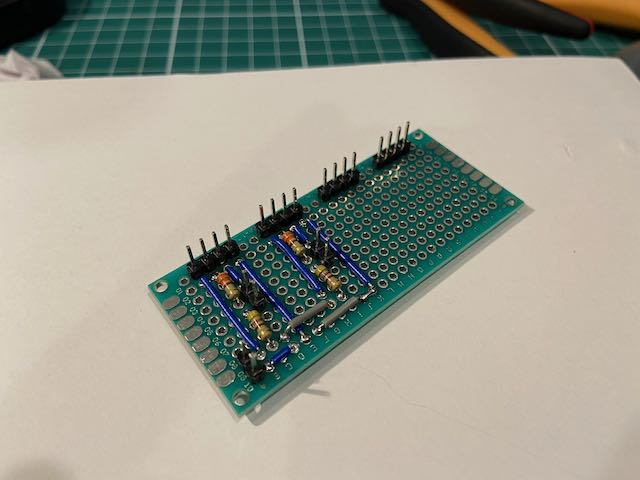
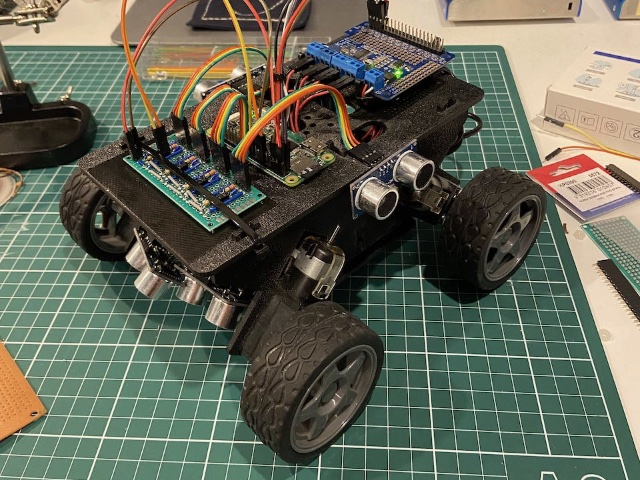

# Rover Kit

Adventures in building a toy rover that can respond to commands over Wi-Fi and send back readings from ultrasonic distance sensors.

## Parts

The rover is based on the following parts:

* [Whippersnapper Runt Rover](https://www.servocity.com/whippersnapper-runt-rover)
* [Raspberry Pi Zero W](https://www.raspberrypi.com/products/raspberry-pi-zero-w)
* [Adafruit DC & Stepper Motor HAT](https://www.adafruit.com/product/2348)
* [HC-SR04 Ultrasonic Distance Sensor](https://www.sparkfun.com/products/15569) (x4)

This is all wired up with an assortment of resistors, jumper wires, and breadboards.

Power to the Motor HAT is provided by a 12V battery pack. And power to the Raspberry Pi is provided by a portable USB power supply.

### Inspiration

This project is inspired a series of blog posts that Mat Kelcey wrote about building a rover (I've used the same basic parts) and training it to move around autonomously.

My project is less ambitious. Seeing what he did made me think it would be fun just to tackle it as a hardware hacking project.

### Early Prototype

When I first started this project, I was using a regular Raspberry Pi 3.

I eventually switched to using a Raspberry Pi Zero W, so that power usage and space requirements would be reduced.

The two front sensors were not attached when I took this photo.

Part way through soldering the final sensor interface board (this was very slow, because I'm new to soldering):

It all felt much neater with the new interface board. Now to figure out wiring:

Other photos can be found [here](./photos).

## Python

The scripts for controlling the rover are written in Python, and rely on some very useful libraries:

* [Adafruit_CircuitPython_MotorKit](https://github.com/adafruit/Adafruit_CircuitPython_MotorKit)
* [RPi.GPIO](https://pypi.org/project/RPi.GPIO)

Test scripts:

* [test_motors.py](./src/test_motors.py) - starts and stops each motor in turn
* [test_sensors.py](./src/test_sensors.py) - outputs a series of ultrasonic sensor readings

Main control script:

* [rover_control.py](./src/rover_control.py) - runs a web server that can be used to control the rover

## Rover Control

The _Rover Control_ frontend, which is served by the [rover_control.py](./src/rover_control.py) script, is pretty ordinary HTML and JavaScript. It currently provides the following commands:

* Forwards
* Backwards
* Spin Clockwise
* Spin Counter-clockwise

The code can be found in [src/web](./src/web).

## License

This code is licensed under the MIT License.

See the LICENSE file for more information.
