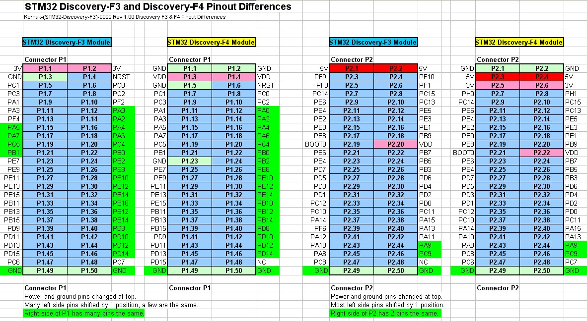

# Firmware

This directory contains code intended to be run on STM32 microcontrollers.

## Prerequisites

Download and install [STM32CubeProgrammer](https://www.st.com/en/development-tools/stm32cubeprog.html).

## Pinouts

## References

* [STM32 Discovery-F3 and Discovery-F4 Differences](https://kornakprotoblog.blogspot.com/2012/10/stm32-discovery-f3-and-discovery-f4.html)
