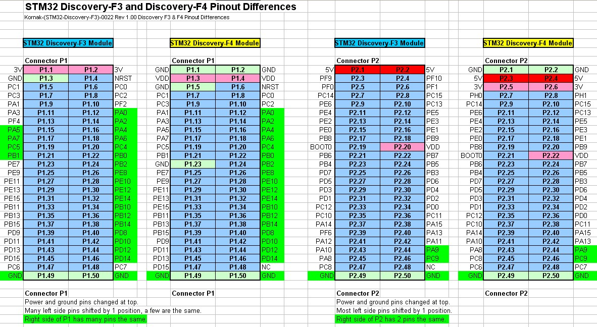

# Firmware

This directory contains code intended to be run on STM32 microcontrollers.

## Prerequisites

Download and install [STM32CubeProgrammer](https://www.st.com/en/development-tools/stm32cubeprog.html).

## Examples

### `hello`

A TinyGo "Hello World" example that communicates over STM32F407 Discovery USART2 (`115200` baud) on PA2/PA3. It prints a hello line once per second.

The STM32F407 Discovery Board exposes a virtual COM port (VCP), but that VCP is not connected to the STM32F407 USART by firmware alone. To see this example in `minicom` you will need an external USB-UART adapter. Connect the adapter's RX to PA2 (`USART2_TX`), and TX to PA3 (`USART2_RX`). You will also need to connect the adapter's GND wire to GND on the board.

Open the serial device using `minicom`, configured at `115200 8N1` with flow control disabled:

```bash
sudo minicom -b 115200 -o -D /dev/ttyUSB0
```

### `sonar`

Streams framed sonar samples over UART using the `pkg/uart` protocol.

## Pinouts



## References

* [STM32 Discovery-F3 and Discovery-F4 Differences](https://kornakprotoblog.blogspot.com/2012/10/stm32-discovery-f3-and-discovery-f4.html)
